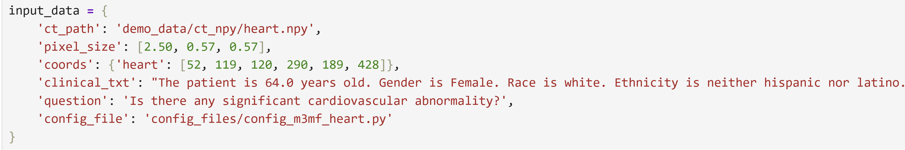
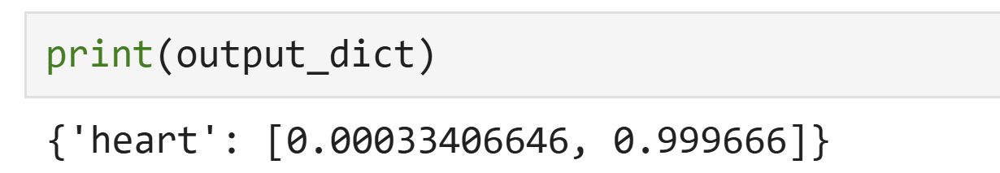
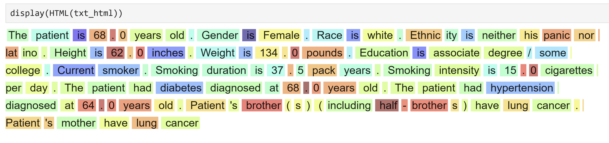

# Welcome to the successful reimplementation of M3FM!

## Input

## Methods

1) 3D CT is divided into many patches, each patch is embedded to one token. Leveraging multi-scale tokenizer to adapt to different tasks, and using different size of patch to handle different tasks.
2) Adding position and physical size information to token, so that model can know the exact postion and size of this patch.
3) texts are transformed into token through text tokenizer and text transformer.
4) Three kinds of token (image token, text token, task token) combined into attention and output a shared feature.

## Output
1) Output_dict

2) Txt_html

3) Img

4) Img_attn
